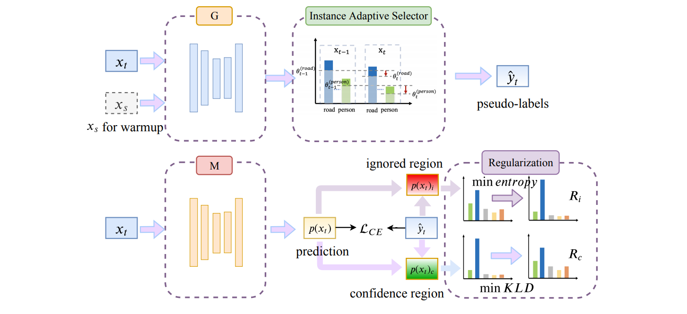

# IAST: Instance Adaptive Self-training for Unsupervised Domain Adaptation (ECCV 2020)
This repo is the official implementation of our paper ["Instance Adaptive Self-training for Unsupervised Domain Adaptation"](https://arxiv.org/abs/2008.12197)

## Introduction

### Abstract
The divergence between labeled training data and unlabeled testing data is a significant challenge for recent deep learning models. Unsupervised domain adaptation (UDA) attempts to solve such a problem. Recent works show that self-training is a powerful approach to UDA. However, existing methods have difficulty in balancing scalability and performance. In this paper, we propose an instance adaptive self-training framework for UDA on the task of semantic segmentation. To effectively improve the quality of pseudo-labels, we develop a novel pseudo-label generation strategy with an instance adaptive selector. Besides, we propose the region-guided regularization to smooth the pseudo-label region and sharpen the non-pseudo-label region. Our method is so concise and efficient that it is easy to be generalized to other unsupervised domain adaptation methods. Experiments on 'GTA5 to Cityscapes' and 'SYNTHIA to Cityscapes' demonstrate the superior performance of our approach compared with the state-of-the-art methods.

### IAST Overview


### Result
| source  | target     | device                | GPU memory | mIoU-19 | mIoU-16 | mIoU-13 | model |
|---------|------------|-----------------------|------------|---------|---------|---------|-------|
| GTA5    | Cityscapes | Tesla V100-32GB       | 18.5 GB    | 51.88   | -       | -       |   [download](https://doc-0g-84-docs.googleusercontent.com/docs/securesc/dq39omgiccorh3pje9gf9jqe0ho2o32t/okfc1smm2bcoq72donp5errn7er5ke94/1606415025000/11665013932396648190/11665013932396648190/1y_juW7C2HRKUMasXUsDLc3SEtB4pGzDf?e=download&authuser=0&nonce=vt38gsvtkf6ag&user=11665013932396648190&hash=j02lc3mafnn05po081qo7d7bjv4p99bf)    |
| GTA5    | Cityscapes | Tesla T4              | 6.3 GB     | 51.20   | -       | -       |   [download](https://doc-14-84-docs.googleusercontent.com/docs/securesc/dq39omgiccorh3pje9gf9jqe0ho2o32t/1o7gnh830h80datpocrsacjik7eft9dp/1606415100000/11665013932396648190/11665013932396648190/1Tl8eMRsYLeTP4OQS9vAEqLpKwfrakOyi?e=download&authuser=0)    |
| SYNTHIA | Cityscapes | Tesla V100-32GB       | 18.5 GB    | -       | 51.54   | 57.81   |   [download](https://doc-04-84-docs.googleusercontent.com/docs/securesc/dq39omgiccorh3pje9gf9jqe0ho2o32t/kji2mu504dlf71cnb5du9dj4d6td1k87/1606415025000/11665013932396648190/11665013932396648190/1IkElfEynRJWfJLssA0dM38NVRMufp1fa?e=download&authuser=0)    |
| SYNTHIA | Cityscapes | Tesla T4              | 6.3 GB     | -       | -       | -       |       |


## Setup

### 1) Envs
- Pytorch >= 1.0
- Python >= 3.6
- cuda >= 9.0
 
Install python packages
```
$ pip install -r  requirements.txt
```

`apex` :  Tools for easy mixed precision and distributed training in Pytorch
```
git clone https://github.com/NVIDIA/apex
cd apex
pip install -v --no-cache-dir --global-option="--cpp_ext" --global-option="--cuda_ext" ./
```

### 2) Download Dataset
Please download the datasets from these links:

- [GTA5](https://download.visinf.tu-darmstadt.de/data/from_games/) 
- [SYNTHIA](https://synthia-dataset.net/)
- [Cityscapes](https://www.cityscapes-dataset.com/)

Dataset directory should have this structure:

```
${ROOT_DIR}/data/GTA5/
${ROOT_DIR}/data/GTA5/images
${ROOT_DIR}/data/GTA5/labels

${ROOT_DIR}/data/SYNTHIA_RAND_CITYSCAPES/RAND_CITYSCAPES
${ROOT_DIR}/data/SYNTHIA_RAND_CITYSCAPES/RAND_CITYSCAPES/RGB
${ROOT_DIR}/data/SYNTHIA_RAND_CITYSCAPES/RAND_CITYSCAPES/GT

${ROOT_DIR}/data/cityscapes
${ROOT_DIR}/data/cityscapes/leftImg8bit
${ROOT_DIR}/data/cityscapes/gtFine
```

### 3) Download Pretrained Models (Coming soon)

We provide pre-trained models. We recommend that you download them and put them in `pretrained_models/`, which will save a lot of time for training and ensure consistent results.

V100 models
- GTA5 to Cityscapes: [G_gtav_at_warmup_v100.pth](https://doc-04-84-docs.googleusercontent.com/docs/securesc/dq39omgiccorh3pje9gf9jqe0ho2o32t/8v4hf70ar6o3dlgtk4fsunskkk4jbi0v/1606414350000/11665013932396648190/11665013932396648190/17Ajhp73mJ7XYDNnmxgIPSYR-LChuC9vY?e=download&authuser=0) and [M_gtav_at_warmup_v100.pth](https://doc-08-84-docs.googleusercontent.com/docs/securesc/dq39omgiccorh3pje9gf9jqe0ho2o32t/8koq3hrq096bf4opde4cvvbo1lc7iqf0/1606414350000/11665013932396648190/11665013932396648190/1MmruHl_vzu6D7keSJl6pT4y15slZX-ev?e=download&authuser=0)
- SYNTHIA to Cityscapes: [G_syn_at_warmup_v100.pth](https://doc-0o-84-docs.googleusercontent.com/docs/securesc/dq39omgiccorh3pje9gf9jqe0ho2o32t/j854echg1oo95ofehqof1d1j18pk1jm6/1606414350000/11665013932396648190/11665013932396648190/1xhwGXUP9sMhh03OY2LVE4jX6t6zje8VI?e=download&authuser=0&nonce=d3orioj576e7k&user=11665013932396648190&hash=52o1rpppjppc1emn1b8n3amf9nc5d9gq) and [M_syn_at_warmup_v100.pth](https://doc-10-84-docs.googleusercontent.com/docs/securesc/dq39omgiccorh3pje9gf9jqe0ho2o32t/og0khk2s4s9nlsrs6f02t45e5jg0fbtg/1606414350000/11665013932396648190/11665013932396648190/1f-nNpL1Z0sMdCnH-DF159HxNlfhOnAZS?e=download&authuser=0)

T4 models
- GTA5 to Cityscapes: [G_gtav_at_warmup_t4.pth](https://doc-14-84-docs.googleusercontent.com/docs/securesc/dq39omgiccorh3pje9gf9jqe0ho2o32t/ho3vi1ppq7upb02a4jsbs995o785krnq/1606414350000/11665013932396648190/11665013932396648190/1J6TbdDaD5gkh68kN_5qDUd1hJ_JhhWTb?e=download&authuser=0) and [M_gtav_at_warmup_t4.pth](https://doc-0g-84-docs.googleusercontent.com/docs/securesc/dq39omgiccorh3pje9gf9jqe0ho2o32t/fbmq7mpvns7qv4kta3f8s5r4on5jtkvn/1606414350000/11665013932396648190/11665013932396648190/1MpgMGQVPM9hdpgeFoBXTg1Ltc5pJHmsS?e=download&authuser=0)
- SYNTHIA to Cityscapes: coming soon

(Optional) Of course, if you have plenty of time, you can skip this step and start training from scratch. We also provide these scripts.

## Training
Our original experiments are all carried out on Tesla-V100, and there will be a large number of GPU memory usage (`batch_size=8`). For low GPU memory devices, we also trained on Tesla-T4 to ensure that most people can reproduce the results (`batch_size=2`).


Start self-training (download the pre-trained models first)

```
cd code

# GTA5 to Cityscapes (V100)
sh ../scripts/from_scratch/run_gtav2cityscapes_self_traing_v100.sh
# GTA5 to Cityscapes (T4)
sh ../scripts/from_scratch/run_gtav2cityscapes_self_traing_t4.sh
```

```
# SYNTHIA to Cityscapes (V100)
sh ../scripts/from_scratch/run_syn2cityscapes_self_traing_v100.sh
# SYNTHIA to Cityscapes (T4)
sh ../scripts/from_scratch/run_syn2cityscapes_self_traing_t4.sh
```


(Optional) Training from scratch
```
cd code

# GTA5 to Cityscapes (V100)
sh ../scripts/from_scratch/run_gtav2cityscapes_self_traing_v100.sh
# GTA5 to Cityscapes (T4)
sh ../scripts/from_scratch/run_gtav2cityscapes_self_traing_t4.sh
```

```
# SYNTHIA to Cityscapes (V100)
sh ../scripts/from_scratch/run_syn2cityscapes_self_traing_v100.sh
# SYNTHIA to Cityscapes (T4)
sh ../scripts/from_scratch/run_syn2cityscapes_self_traing_t4.sh
```

## Evaluation

```
cd code
python eval.py --config_file <path_to_config_file> --resume_from <path_to_*.pth_file>
```

Support multi-scale testing and flip testing.
```
# Modify the following parameters in the config file

TEST:
  RESIZE_SIZE: [[1024, 512], [1280, 640], [1536, 768], [1800, 900], [2048, 1024]] 
  USE_FLIP: False 
```

## Citation
Please cite this paper in your publications if it helps your research:

```
@article{mei2020instance,
  title={Instance Adaptive Self-Training for Unsupervised Domain Adaptation},
  author={Mei, Ke and Zhu, Chuang and Zou, Jiaqi and Zhang, Shanghang},
  journal={arXiv preprint arXiv:2008.12197},
  year={2020}
}
```